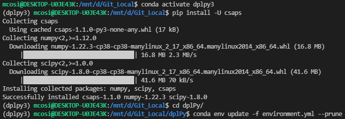
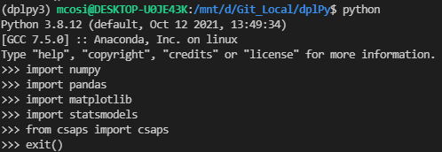

# dplPy
The Dendrochronology Program Library for Python

## Issues

We're using [ZenHub](https://app.zenhub.com/workspaces/opendendro-60ec698d8790d700171ceee8/board?repos=385244315) to manage our [GitHub Issues](https://github.com/opendendro/dplpy/issues)

## Building Environment

> :warning: **it is recommended to _NOT_ use GitHub Codespaces**

> :warning: **Prior to creating an enviroment, ensure that you are outside of `base` by doing `conda deactivate`.**

1\. Create a conda environment with python version 3.8 as default python:

```
conda create -n dplpy3 python=3.8
```


When prompted for permission to install required packages (with `y/n`), select `y`. Upon finishing installing the required packages, reload your terminal (close and re-open terminal).

> :warning: **If terminal shows you are in `base`, exit with `conda deactivate`.**

2\. Activate your environment:

```
conda activate dplpy3
```

From within your environment, install [CSAPS](https://pypi.org/project/csaps/#description):

```
pip install -U csaps
```

Update your environment:

```
conda env update -f environment.yml --prune
```



Your environment should be successfully built.

3\. Your python environment should be able to import `numpy`, `pandas`, `matplotlib`, `statsmodels` and `csaps`:

